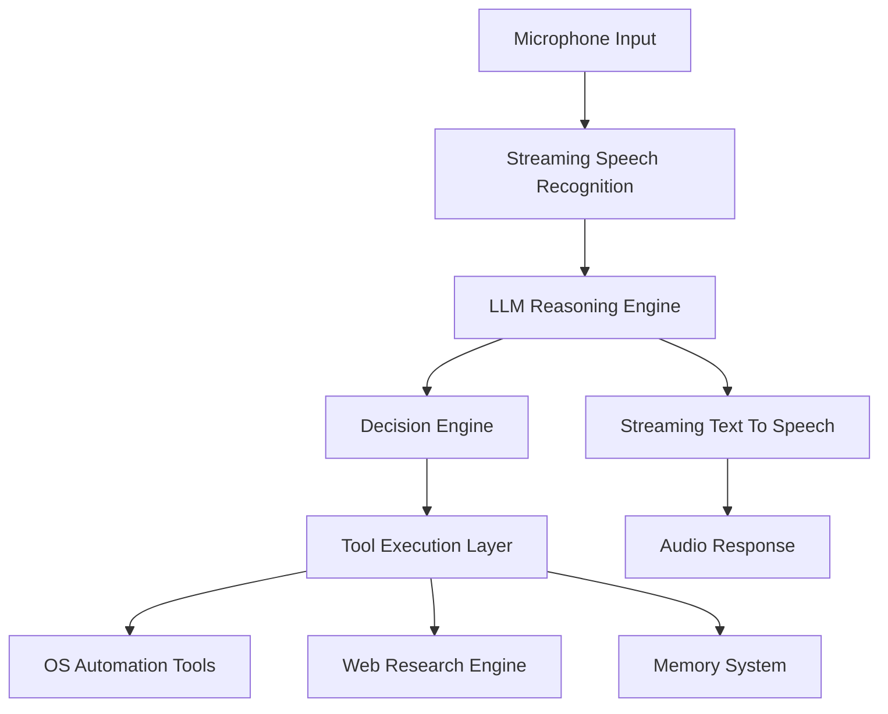
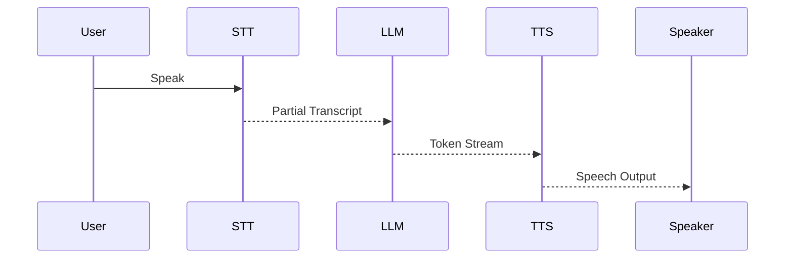

<!-- HERO BANNER -->

<p align="center">
  
</p>

<p align="center">
A Real-Time Voice Driven Operating System built with Streaming AI Pipelines
</p>

<p align="center">


</p>

---

# 🎙️ VoiceOS

VoiceOS is a **real-time voice-driven operating system interface** that allows users to interact with their computer using natural language.

Unlike traditional assistants, VoiceOS is built as a **modular AI system architecture** combining:

• Streaming Speech Recognition
• LLM Reasoning Engine
• Event Driven System Architecture
• Tool Execution Framework
• Web Research Engine
• OS Automation Layer
• Real-Time Conversational Feedback

The system is designed to run **fully locally on CPU hardware** with optimized streaming pipelines.

---

# ✨ Core Capabilities

### 🎤 Real-Time Speech Interface

Continuous speech recognition using streaming transcription.

### 🧠 LLM Reasoning Engine

Interprets commands, plans actions, and decides which tools to execute.

### 🔎 Web Research Agent

VoiceOS can search the web, analyze sources, and summarize insights.

### 🖥️ OS Automation

Control your computer using natural voice commands.

Examples:

Open applications
Type text
Switch windows
Clipboard automation

### 💬 Conversational Feedback

Back-channel listening makes the assistant behave more naturally.

Example:

```
User speaking...
VoiceOS: "mm-hmm"
VoiceOS: "I see"
```

---

# 🧠 System Architecture

The system follows an **event-driven AI architecture**.



This architecture provides:

• modular components
• asynchronous processing
• easy extensibility

---

# ⚡ Low Latency Streaming Pipeline

Traditional voice assistants run sequentially:

```
Speech → STT → LLM → TTS
```

VoiceOS uses a **parallel streaming pipeline**.



This pipeline enables responses to begin **before the full sentence is processed**.

Average latency:

```
~600ms on CPU
```

---

# 🖼️ Demo (Add Your GIF Here)

<p align="center">

</p>

Example interactions:

```
Open Chrome
Search for reinforcement learning robotics
Type hello world
Summarize latest AI research
Switch window
```

---

# 📂 Project Structure

```
voice-os

backend

 core
  event_bus.py
  events.py
  stream_pipeline.py

 stt
  streaming_whisper.py

 llm
  streaming_llm.py

 tts
  streaming_tts.py

 listener
  backchannel_engine.py

 interrupt
  speech_state.py
  tts_controller.py

 research
  web_search.py
  summarizer.py
  analysis_engine.py

 tools
  os_control

 model_manager
  hardware_detector.py
  model_registry.py
  model_downloader.py
  model_manager.py

models

README.md
requirements.txt
```

---

# 🧠 Model System

VoiceOS uses optimized local AI models.

| Component          | Model                       |
| ------------------ | --------------------------- |
| Speech Recognition | Whisper Tiny                |
| Reasoning          | Mistral 7B (GGUF Quantized) |
| Speech Generation  | Coqui Tacotron              |

The **Model Manager** automatically:

• detects hardware
• downloads models
• selects optimal configuration

---

# 💻 Installation

### 1 Clone Repository

```
git clone https://github.com/yourusername/voice-os.git
cd voice-os
```

---

### 2 Create Environment

```
python -m venv venv
```

Activate:

Mac/Linux

```
source venv/bin/activate
```

Windows

```
venv\Scripts\activate
```

---

### 3 Install Dependencies

```
pip install -r requirements.txt
```

Main libraries include:

```
faster-whisper
llama-cpp-python
coqui-tts
beautifulsoup4
requests
pyautogui
psutil
```

---

### 4 Run VoiceOS

```
python backend/main.py
```

First launch will:

• detect hardware
• download AI models
• initialize system components

---

# 🎤 Example Voice Commands

```
Open Chrome
Search for latest reinforcement learning papers
Type hello world
Switch window
Summarize today's AI news
```

---

# ⚙️ System Components

## Event Bus

Central communication layer connecting all modules.

Handles:

• message routing
• asynchronous events
• module communication

---

## LLM Decision Engine

Interprets commands and generates structured actions.

Example output:

```
{
 intent: "open_application",
 tool: "os_open_app",
 parameters: {
   app: "chrome"
 }
}
```

---

## Tool Execution Layer

Executes safe system operations.

Supported tools:

OS automation
Web research
Clipboard management
Keyboard control

---

## Permission System

Every OS action requires confirmation.

This prevents:

unsafe automation
destructive commands
malicious behavior

---

# ⚡ Performance

Typical CPU laptop performance:

| Stage              | Latency |
| ------------------ | ------- |
| Speech detection   | 50ms    |
| STT partial result | 200ms   |
| LLM first token    | 300ms   |
| TTS playback       | 200ms   |

Total perceived latency:

```
~600ms
```

---

# 🚀 Future Roadmap

Planned improvements:

Multi-agent AI architecture
Long-term memory graph
Desktop GUI interface
Autonomous task planning
Distributed inference

---

# 🤝 Contributing

Contributions are welcome.

Areas of interest:

AI agents
speech processing
system design
low latency inference

---

# 📜 License

MIT License

---

# ⭐ Support

If you find this project interesting:

⭐ Star the repository
🍴 Fork the project
🚀 Build your own VoiceOS extensions

---

<p align="center">
Built with ❤️ for exploring the future of voice driven computing
</p>

<p align="center">

</p>
