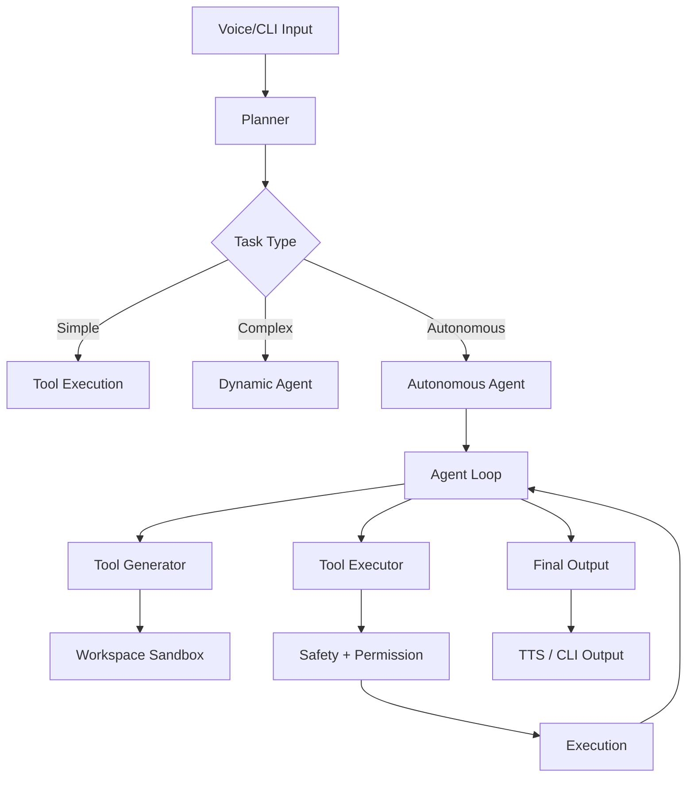

<p align="center">
  
</p>

<h1 align="center">🎙️ VoiceOS</h1>
<p align="center">
A Voice + CLI Driven Multi-Agent Operating System with Autonomous AI Capabilities
</p>

<p align="center">


</p>

---

## 🚀 Overview

VoiceOS is a **next-generation AI operating system interface** that combines:

* 🎤 Real-time voice interaction
* 🧠 Multi-agent reasoning system
* 🤖 Autonomous agent execution
* 🔐 Permission-based safety architecture
* 🐳 Docker-based isolated runtime

VoiceOS evolves beyond traditional assistants into a:

> **Voice-Controlled, Multi-Agent, Autonomous AI System**

---

## ✨ Key Features

### 🎤 Voice + CLI Interaction

* Real-time speech input (STT)
* Streaming responses (TTS)
* CLI fallback for development and control

---

### 🧠 Hybrid Multi-Agent System

* Core agents (Planner, Router, Safety)
* Dynamic agents (YAML-defined roles)
* Autonomous agent loop (goal-driven execution)

---

### 🤖 Autonomous Agent Mode

* Iterative reasoning (think → act → observe)
* Tool generation
* Code execution in sandbox
* Multi-step workflow automation

---

### 🔎 Web Research Engine

* Search → Fetch → Analyze → Summarize
* Multi-source reasoning

---

### 💻 Code Development Mode

* Generate code
* Edit files
* Execute scripts
* Debug and iterate

---

### 🛠️ System Automation

* Open applications
* File operations
* OS control (safe and permission-based)

---

### 🔐 Safety & Permissions

* Explicit user approval required
* Sandboxed execution
* Full logging of actions

---

## 🧠 Architecture



---

## ⚡ Execution Modes

| Mode       | Description             |
| ---------- | ----------------------- |
| Simple     | Direct tool execution   |
| Complex    | Dynamic agent execution |
| Autonomous | Iterative agent loop    |

---

## 📂 Project Structure

```
VoiceOS/

├── agents/                    # Multi-agent system
│   ├── core/                 # Core agents (Planner, Router, Safety)
│   ├── autonomous/           # Autonomous agent loop
│   ├── dynamic/              # Dynamic agent roles
│   └── roles/                # YAML-defined agent roles
├── tools/                    # Native VoiceOS tools
│   ├── file_tools/           # File operations
│   ├── web_tools/            # Web browsing & scraping
│   ├── code_tools/           # Code execution
│   ├── document_tools/       # Document processing
│   └── scheduler_tools/      # Task scheduling
├── core/                     # Core system components (restructured)
│   ├── config.py            # Configuration management
│   ├── logger.py            # Logging system
│   ├── event.py             # Event system
│   ├── security.py          # Security system
│   ├── orchestrator.py      # System orchestrator
│   ├── config_manager.py    # Configuration manager
│   ├── plugins/             # Plugin system (8 modules)
│   │   ├── secure_plugin_integration.py
│   │   ├── plugin_lifecycle.py
│   │   ├── plugin_registry.py
│   │   ├── plugin_configuration.py
│   │   ├── plugin_error_handling.py
│   │   ├── plugin_monitoring.py
│   │   ├── plugin_testing.py
│   │   └── complete_plugin_integration.py
│   ├── helpers/             # Helper system (4 modules)
│   │   ├── secure_helper_integration.py
│   │   ├── helper_bridge_integration.py
│   │   ├── helper_extension_discovery.py
│   │   └── helper_extension_monitoring.py
│   ├── extensions/          # Extension system (2 modules)
│   │   ├── secure_extension_integration.py
│   │   └── extension_point_system.py
│   ├── integration/         # Integration framework (2 modules)
│   │   ├── integration_patterns.py
│   │   └── controlled_execution.py
│   ├── monitoring/          # Monitoring system (2 modules)
│   │   ├── performance_monitor.py
│   │   └── error_recovery.py
│   ├── events/              # Event system (3 modules)
│   │   ├── event_bus.py
│   │   ├── event_handlers.py
│   │   └── events.py
│   ├── cli/                 # CLI system (2 modules)
│   │   ├── voice_cli_integration.py
│   │   └── response_builder.py
│   ├── pipelines/           # Pipeline system (1 module)
│   │   └── stream_pipeline.py
│   └── system/              # System management (2 modules)
│       ├── system_verification.py
│       └── unified_integration_dashboard.py
├── permissions/              # Permission & safety system
├── audio/                    # Voice processing
├── llm/                      # LLM integration
├── memory/                   # Memory management
├── plugins/                  # Plugin system
├── workspace/                # Workspace management
├── frontend/                 # Web interface
├── docs/                     # Documentation
└── models/                   # AI models
```

---

## � Core Integration Systems

VoiceOS features a **comprehensive integration framework** with restructured core components:

### 🔌 Plugin System
- **Secure Plugin Integration**: Security-first plugin loading and validation
- **Plugin Lifecycle**: Complete plugin state management (DISCOVERED → ACTIVE → SUSPENDED)
- **Plugin Registry**: Centralized plugin discovery and registration
- **Plugin Configuration**: Multi-scope configuration management
- **Plugin Error Handling**: Comprehensive error recovery and reporting
- **Plugin Monitoring**: Real-time performance and health monitoring
- **Plugin Testing**: Built-in security and compatibility testing

### 🤝 Helper System
- **Secure Helper Integration**: Categorized helper function management
- **Helper Bridge Integration**: VoiceOS tool bridging with multiple modes
- **Helper Extension Discovery**: Background discovery and validation
- **Helper Extension Monitoring**: System-wide helper metrics

### 🔗 Extension System
- **Secure Extension Integration**: Extension type management and security
- **Extension Point System**: Hook-based extension with decorators
- **Extension Decorators**: Easy-to-use decorators for common extension points
  - `@before_tool_execution`, `@after_tool_execution`
  - `@before_llm_request`, `@after_llm_response`
  - `@data_processing`, `@user_input_validation`
  - `@error_handling`, `@logging_decorator`

### 📊 Integration Framework
- **Integration Patterns**: Standardized integration approaches
- **Controlled Execution**: Sandboxed execution with resource limits
- **Performance Monitoring**: Real-time system performance tracking
- **Error Recovery**: Automatic error detection and recovery

### 🎛️ Unified Dashboard
- **Integration Dashboard**: Centralized management interface
- **System Verification**: Automated system health checks
- **Real-time Monitoring**: Live system metrics and status

---

## �🐳 Docker Setup

```bash
docker build -t voiceos .
docker run -it voiceos
```

---

## ▶️ Run Locally

```bash
# Install dependencies
pip install -r requirements.txt

# Run VoiceOS
python main.py

# Or with specific configuration
VOICEOS_CONFIG=dev python main.py
```

---

## 🧪 Example Commands

```
"Open Chrome"
"Search latest AI research"
"Write a Python script to scrape data"
"Analyze this dataset"
"Automate this workflow"
```

---

## 🔐 Safety Model

All actions follow:

```
Agent → Safety → Permission → Execution
```

---

## 🚀 Roadmap

- [x] Native VoiceOS tools integration
- [x] Permission-based safety system
- [x] Multi-agent execution modes
- [ ] Advanced multi-agent collaboration
- [ ] Enhanced GUI interface
- [ ] Plugin marketplace
- [ ] Distributed agent execution
- [ ] Voice-controlled IDE integration
- [ ] Real-time collaboration features

---

## 🤝 Contributing

Contributions welcome.

---

## 📜 License

MIT License
