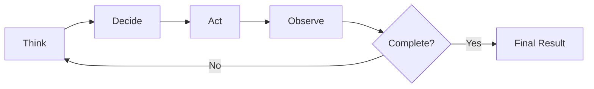

# 🤖 VoiceOS Agent System

VoiceOS employs a sophisticated multi-agent architecture with three distinct agent types, each designed for specific task complexities and execution patterns.

---

## 🏛️ Core Agents

Core agents form the foundation of the VoiceOS system, handling essential functions that keep the system operational and secure.

### 🧠 Planner Agent
**Location**: `agents/core/planner.py`

**Responsibilities**:
- Task classification and complexity analysis
- Execution strategy formulation
- Resource requirement assessment
- Agent selection guidance

**Key Methods**:
- `analyze_input()`: Classify user requests
- `generate_plan()`: Create execution strategies
- `estimate_execution_time()`: Predict task duration

**Task Types Handled**:
- **Simple**: Direct tool execution (< 1 second)
- **Complex**: Agent-mediated execution (1-30 seconds)
- **Autonomous**: Iterative execution (> 30 seconds)

### 🛣️ Router Agent
**Location**: `agents/core/router.py`

**Responsibilities**:
- Task routing to appropriate executors
- Load balancing across agents
- Priority queue management
- Resource allocation

**Routing Logic**:
```python
if task.type == "simple":
    route_to_tool_registry()
elif task.type == "complex":
    route_to_dynamic_agent()
elif task.type == "autonomous":
    route_to_autonomous_agent()
```

### 🛡️ Safety Agent
**Location**: `agents/core/safety.py`

**Responsibilities**:
- Risk assessment and validation
- Permission checking
- Security policy enforcement
- Audit trail maintenance

**Safety Checks**:
- Input validation and sanitization
- Permission level verification
- Resource limit enforcement
- Malicious pattern detection

---

## 🎭 Dynamic Agents

Dynamic agents are specialized roles created through YAML configuration and prompt templates, designed for specific domains and tasks.

### Agent Structure
```
agents/roles/
├── researcher/
│   ├── agent.yaml          # Agent configuration
│   ├── prompt.txt          # System prompt
│   └── tools.yaml          # Preferred tools
├── developer/
│   ├── agent.yaml
│   ├── prompt.txt
│   └── tools.yaml
└── analyst/
    ├── agent.yaml
    ├── prompt.txt
    └── tools.yaml
```

### 🔬 Researcher Agent
**Specialization**: Information gathering and analysis

**Capabilities**:
- Web research and data collection
- Source verification and fact-checking
- Information synthesis and summarization
- Citation management

**Preferred Tools**:
- `browser_tool` for web scraping
- `document_processor` for analysis
- `enhanced_file_manager` for data storage

**Configuration Example**:
```yaml
name: "researcher"
version: "1.0.0"
description: "Specialized in information gathering and analysis"
permission_level: "medium"
tools:
  - browser_tool
  - document_processor
  - enhanced_file_manager
capabilities:
  - web_research
  - data_analysis
  - source_verification
```

### 💻 Developer Agent
**Specialization**: Code generation and development

**Capabilities**:
- Code generation in multiple languages
- File manipulation and project management
- Debugging and error resolution
- Testing and validation

**Preferred Tools**:
- `code_executor` for code execution
- `enhanced_file_manager` for file operations
- `browser_tool` for documentation lookup

### 📊 Analyst Agent
**Specialization**: Data analysis and insights

**Capabilities**:
- Statistical analysis
- Data visualization
- Pattern recognition
- Report generation

**Preferred Tools**:
- `document_processor` for data processing
- `code_executor` for analysis scripts
- `enhanced_file_manager` for data handling

---

## 🤖 Autonomous Agent

The autonomous agent represents the most sophisticated execution mode, capable of handling complex, multi-step workflows through iterative reasoning.

### 🔄 Autonomous Loop
**Location**: `agents/autonomous/agent_loop.py`

**Execution Cycle**: `Think → Decide → Act → Observe`



### 🧠 Phase Details

#### Think Phase
- Analyze current task state and progress
- Review completed actions and results
- Identify remaining objectives and blockers
- Plan next strategic steps

#### Decide Phase
- Select optimal action based on context
- Validate tool availability and permissions
- Confirm execution strategy and resource needs
- Assess potential risks and mitigations

#### Act Phase
- Execute selected tool or agent action
- Apply safety validations and constraints
- Monitor execution progress and performance
- Handle errors and exceptions gracefully

#### Observe Phase
- Analyze action results and outcomes
- Update task state and progress metrics
- Assess achievement toward goals
- Determine need for strategy refinement

### 🎯 Capabilities

#### Complex Workflow Management
- Multi-step task decomposition
- Dependency resolution
- Parallel execution coordination
- Error recovery and retry logic

#### Dynamic Tool Generation
- Runtime tool creation
- Custom tool specialization
- Tool composition and chaining
- Performance optimization

#### Self-Correction and Adaptation
- Error pattern recognition
- Strategy adjustment based on feedback
- Learning from execution history
- Optimization of execution paths

---

## 🔄 Agent Lifecycle Management

### 1. Task Reception and Analysis
```python
def receive_task(user_input: str) -> TaskPlan:
    # Input processing and validation
    # Task classification
    # Resource requirement assessment
    # Agent selection
```

### 2. Agent Selection and Initialization
```python
def select_agent(task_plan: TaskPlan) -> Agent:
    # Choose appropriate agent type
    # Initialize agent with context
    # Set up execution environment
    # Configure permissions and limits
```

### 3. Execution Planning and Setup
```python
def setup_execution(agent: Agent, task: Task) -> ExecutionPlan:
    # Create execution workspace
    # Load required tools and dependencies
    # Establish monitoring and logging
    # Set safety constraints
```

### 4. Task Execution and Monitoring
```python
def execute_task(agent: Agent, plan: ExecutionPlan) -> Result:
    # Execute planned actions
    # Monitor progress and performance
    # Handle errors and exceptions
    # Log all operations
```

### 5. Result Processing and Delivery
```python
def process_result(result: Result) -> Output:
    # Aggregate and format results
    # Generate appropriate output format
    # Update system state and memory
    # Deliver results to user
```

### 6. Cleanup and Resource Management
```python
def cleanup_execution(execution_id: str):
    # Clean up workspace and temporary files
    # Release allocated resources
    # Update agent state and statistics
    # Archive execution logs
```

---

## 🔧 Agent Configuration

### Agent YAML Structure
```yaml
# agent.yaml
name: "agent_name"
version: "1.0.0"
description: "Agent description"
author: "VoiceOS Team"

# Execution Configuration
permission_level: "medium"          # low, medium, high
max_execution_time: 300          # seconds
max_memory_usage: 512            # MB

# Tool Configuration
tools:
  - tool_name:
    priority: "high"
    required: true
  - another_tool:
    priority: "medium"
    required: false

# Capabilities
capabilities:
  - capability_name
  - another_capability

# Constraints
constraints:
  - no_internet_access
  - workspace_only
  - read_only_files

# Learning Configuration
learning:
  enabled: true
  feedback_collection: true
  performance_tracking: true
```

### Prompt Template Structure
```text
# prompt.txt
You are a {agent_name} agent specializing in {specialization}.

Your primary responsibilities:
{responsibilities}

Available tools:
{tools_list}

Safety constraints:
{constraints}

Execution guidelines:
{guidelines}

Always:
- Validate inputs before processing
- Log all significant actions
- Request permission for high-risk operations
- Provide clear explanations for decisions
```

---

## 📊 Agent Performance Metrics

### Execution Metrics
- **Task Completion Rate**: Percentage of tasks successfully completed
- **Average Execution Time**: Mean time per task type
- **Error Rate**: Frequency of execution failures
- **Resource Utilization**: CPU, memory, and storage usage

### Quality Metrics
- **Result Accuracy**: Quality of generated outputs
- **User Satisfaction**: User feedback and ratings
- **Tool Efficiency**: Effectiveness of tool usage
- **Decision Making**: Quality of strategic choices

### Learning Metrics
- **Adaptation Rate**: Speed of performance improvement
- **Pattern Recognition**: Ability to identify patterns
- **Strategy Optimization**: Improvement in execution strategies
- **Error Reduction**: Decrease in repeated mistakes

---

## 🚀 Agent Optimization

### Performance Tuning
- **Caching Strategies**: Result and tool caching
- **Parallel Execution**: Concurrent task processing
- **Resource Pooling**: Shared resource management
- **Lazy Loading**: On-demand component initialization

### Learning and Adaptation
- **Feedback Integration**: User feedback incorporation
- **Pattern Learning**: Execution pattern recognition
- **Strategy Refinement**: Optimization of decision-making
- **Knowledge Base**: Accumulated experience and best practices

### Scalability Improvements
- **Horizontal Scaling**: Multi-instance deployment
- **Load Balancing**: Task distribution optimization
- **Resource Management**: Dynamic allocation strategies
- **Monitoring Enhancement**: Real-time performance tracking

---

## 🔍 Agent Debugging and Monitoring

### Debugging Tools
- **Execution Tracing**: Step-by-step execution tracking
- **State Inspection**: Real-time agent state monitoring
- **Tool Usage Analysis**: Tool performance and usage patterns
- **Error Analysis**: Detailed error tracking and analysis

### Monitoring Dashboards
- **Agent Status**: Real-time agent availability and health
- **Task Progress**: Current task execution status
- **Performance Metrics**: Real-time performance indicators
- **Resource Usage**: System resource consumption

### Log Analysis
- **Structured Logging**: JSON-formatted execution logs
- **Log Aggregation**: Centralized log collection
- **Pattern Analysis**: Log pattern recognition
- **Alert Generation**: Automatic issue detection and alerting
