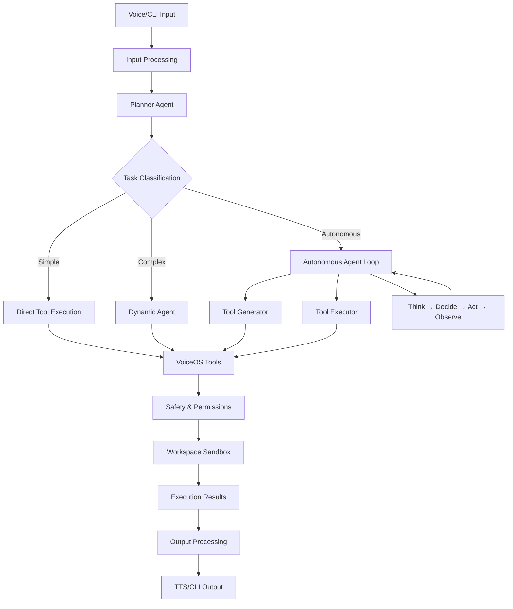
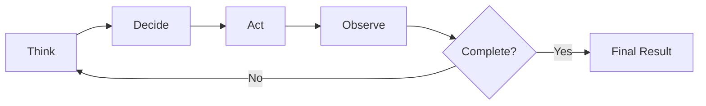
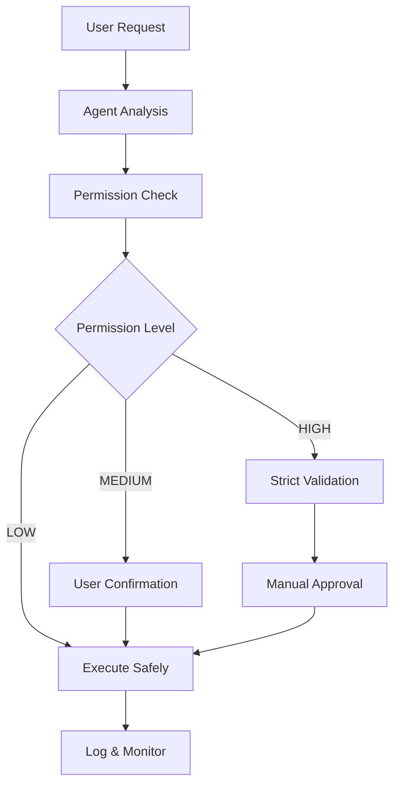
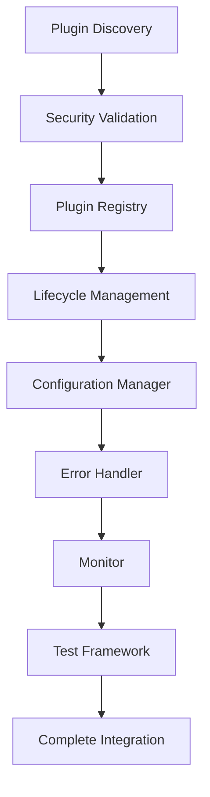
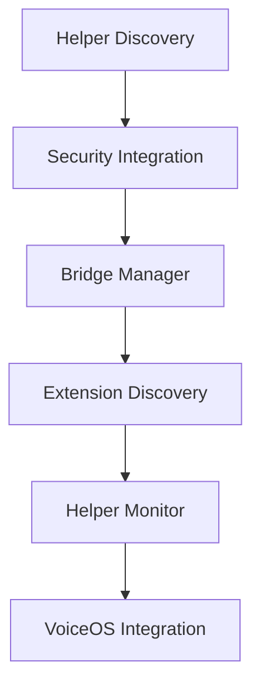
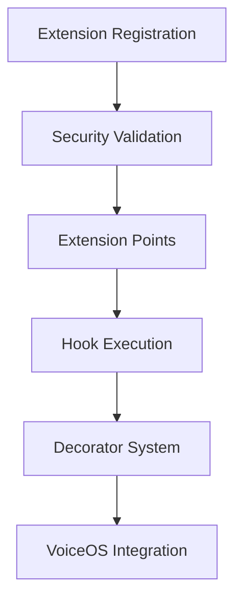
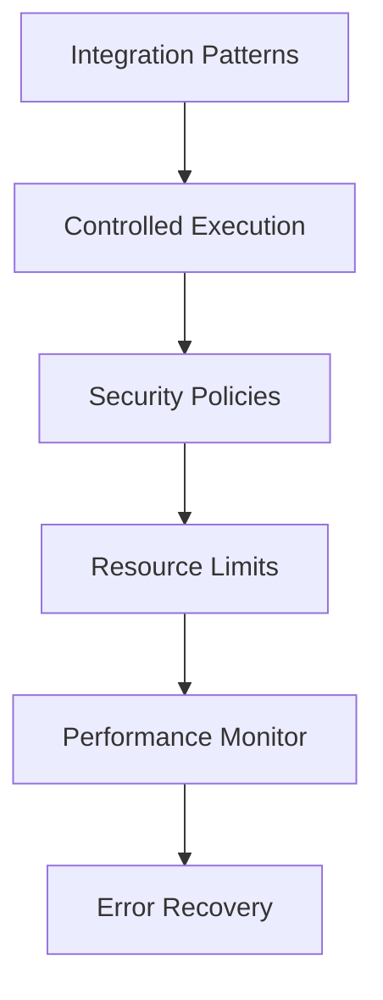
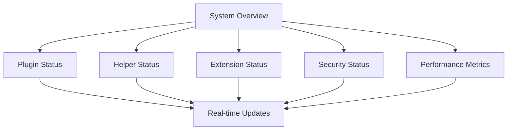

# 🧠 VoiceOS Architecture

VoiceOS is built using a **hybrid multi-agent architecture** with real-time and autonomous capabilities, featuring native VoiceOS tools integration and comprehensive safety systems.

---

## 🏗️ System Overview



---

## 📚 Core Architecture Layers

### 1. Input Layer
**Purpose**: Capture and process user input from multiple modalities

**Components**:
- **Voice Input**: Real-time speech-to-text (Whisper)
- **CLI Input**: Command-line interface for text input
- **Web Interface**: Browser-based interaction
- **API Interface**: RESTful API for programmatic access

**Features**:
- Multi-modal input support
- Real-time processing
- Input validation and sanitization

---

### 2. Planning Layer
**Purpose**: Analyze input and determine optimal execution strategy

**Components**:
- **Planner Agent**: Task classification and planning
- **Router Agent**: Direct tasks to appropriate executors
- **Context Manager**: Maintain conversation context

**Task Types**:
- **Simple**: Direct tool execution (low latency)
- **Complex**: Dynamic agent involvement
- **Autonomous**: Iterative agent loop execution

---

### 3. Agent Layer
**Purpose**: Execute tasks using specialized agents with appropriate capabilities

#### Core Agents
- **Planner**: Task analysis and execution planning
- **Router**: Task routing and agent selection
- **Safety**: Risk assessment and permission validation

#### Dynamic Agents
- **Researcher**: Information gathering and analysis
- **Developer**: Code generation and development
- **Analyst**: Data analysis and insights
- **Custom**: YAML-defined specialized roles

#### Autonomous Agent Loop
- **Iterative Reasoning**: Think → Decide → Act → Observe
- **Tool Generation**: Dynamic tool creation
- **Self-Correction**: Error handling and strategy adjustment

---

### 4. Tool Layer
**Purpose**: Provide secure, sandboxed execution capabilities

#### Native VoiceOS Tools
- **File Tools**: `enhanced_file_manager`
  - Safe file operations within workspace
  - Permission-based access control
  - Comprehensive audit logging

- **Web Tools**: `browser_tool`
  - URL validation and web scraping
  - Content size limits
  - Search engine integration

- **Code Tools**: `code_executor`
  - Sandboxed code execution
  - Resource limits and timeouts
  - Multi-language support

- **Document Tools**: `document_processor`
  - PDF/DOCX/TXT processing
  - Text extraction and analysis
  - Format conversion

- **Scheduler Tools**: `task_scheduler`
  - Task scheduling and management
  - Time-based execution
  - Status tracking

---

### 5. Safety & Permission Layer
**Purpose**: Ensure secure execution with proper authorization

**Components**:
- **Permission Engine**: Multi-level permission system
  - **LOW**: Safe read operations
  - **MEDIUM**: File creation, web access
  - **HIGH**: System operations, deletion

- **Safety Module**: Risk assessment and validation
- **Audit System**: Comprehensive operation logging
- **Sandbox**: Isolated execution environments

---

### 6. Workspace Layer
**Purpose**: Provide isolated, managed execution environments

**Structure**:
```
workspace/
├── task_[id]/           # Task-specific workspace
│   ├── tools/          # Generated tools
│   ├── data/           # Task data
│   ├── logs/           # Operation logs
│   └── output/         # Results
├── logs/               # Global logs
├── temp/               # Temporary files
└── shared/             # Shared resources
```

**Features**:
- Task isolation
- Automatic cleanup
- Resource monitoring
- Access control

---

### 7. Output Layer
**Purpose**: Present results to users through appropriate channels

**Components**:
- **Text-to-Speech**: Natural voice output
- **CLI Display**: Terminal-based output
- **Web Interface**: Rich web-based presentation
- **File Output**: Result file generation

---

## 🔄 Autonomous Agent Loop

### Execution Cycle


### Phase Details

#### Think Phase
- Analyze current state and progress
- Review completed actions
- Identify remaining objectives
- Plan next steps

#### Decide Phase
- Select optimal action based on context
- Validate tool availability
- Check permission requirements
- Confirm execution strategy

#### Act Phase
- Execute selected tool or agent action
- Apply safety validations
- Monitor execution progress
- Handle errors and exceptions

#### Observe Phase
- Analyze action results
- Update task state
- Assess progress toward goals
- Determine need for refinement

---

## 🔐 Security Architecture

### Permission Model


### Safety Measures
- **Workspace Isolation**: All operations confined to workspace
- **Input Validation**: Comprehensive input sanitization
- **Resource Limits**: CPU, memory, and time restrictions
- **Audit Logging**: Complete operation trail
- **Permission Levels**: Hierarchical access control

---

## 📊 Data Flow Architecture

### Input Processing
1. **Capture**: Voice/CLI/Web input
2. **Transcribe**: Speech-to-text conversion
3. **Parse**: Natural language understanding
4. **Validate**: Input sanitization and validation

### Task Execution
1. **Classify**: Task type determination
2. **Plan**: Execution strategy formulation
3. **Execute**: Tool/agent execution
4. **Monitor**: Progress tracking

### Result Processing
1. **Aggregate**: Collect execution results
2. **Format**: Output formatting
3. **Present**: Multi-modal output delivery
4. **Store**: Result persistence

---

## 🧩 Component Integration

### Tool Registry
- **Discovery**: Automatic tool detection
- **Registration**: Tool metadata management
- **Execution**: Secure tool invocation
- **Monitoring**: Performance tracking

### Plugin System
- **Loading**: Dynamic plugin discovery
- **Validation**: Security and compatibility checks
- **Management**: Plugin lifecycle control
- **Isolation**: Plugin sandboxing

### Event System
- **Publishing**: Event emission and handling
- **Subscription**: Component communication
- **Routing**: Event distribution
- **Persistence**: Event logging

---

## 🚀 Performance Architecture

### Optimization Strategies
- **Caching**: Result and tool caching
- **Parallelism**: Concurrent execution
- **Resource Pooling**: Shared resource management
- **Lazy Loading**: On-demand component loading

### Scalability Features
- **Horizontal Scaling**: Multi-instance deployment
- **Load Balancing**: Request distribution
- **Resource Management**: Dynamic allocation
- **Monitoring**: Performance metrics

---

## 🔄 State Management

### Agent States
- **Active**: Currently executing tasks
- **Idle**: Available for new tasks
- **Suspended**: Temporarily paused
- **Error**: Error state recovery

### Task States
- **Pending**: Awaiting execution
- **Running**: Currently executing
- **Completed**: Successfully finished
- **Failed**: Execution failed
- **Cancelled**: User cancelled

### System States
- **Initializing**: System startup
- **Ready**: Operational
- **Maintenance**: Under maintenance
- **Shutdown**: System shutdown

---

## � Core Integration Architecture

VoiceOS features a **restructured core architecture** with comprehensive integration systems:

### Core Structure Overview
```
core/
├── Root Components (7 files)
│   ├── config.py, logger.py, event.py
│   ├── security.py, orchestrator.py
│   └── config_manager.py
├── plugins/ (8 modules) - Plugin System
├── helpers/ (4 modules) - Helper System  
├── extensions/ (2 modules) - Extension System
├── integration/ (2 modules) - Integration Framework
├── monitoring/ (2 modules) - Performance & Error Recovery
├── events/ (3 modules) - Event System
├── cli/ (2 modules) - CLI Integration
├── pipelines/ (1 module) - Stream Processing
└── system/ (2 modules) - Management & Dashboard
```

### Plugin System Architecture


**Key Features**:
- **Security-First**: All plugins undergo security validation
- **State Management**: DISCOVERED → LOADING → ACTIVE → SUSPENDED
- **Configuration**: Multi-scope configuration (GLOBAL, PLUGIN, USER, WORKSPACE, SESSION)
- **Error Recovery**: Automatic error detection and recovery
- **Real-time Monitoring**: Performance metrics and health tracking

### Helper System Architecture


**Key Features**:
- **Categorized Helpers**: FILE_OPERATIONS, WEB_OPERATIONS, DATA_PROCESSING, etc.
- **Bridge Integration**: Multiple bridge modes (DIRECT, WRAPPED, SANDBOXED, PROXY)
- **Tool Registry**: Seamless integration with VoiceOS tools
- **Background Discovery**: Automatic helper detection and validation

### Extension System Architecture


**Key Features**:
- **Extension Types**: HOOK, FILTER, TRANSFORMER, VALIDATOR, PROVIDER, MIDDLEWARE
- **Extension Points**: BEFORE/AFTER tool execution, LLM requests, data processing
- **Decorator-Based**: Easy-to-use decorators for common extension points
- **Priority System**: Hook execution priorities (HIGHEST → LOWEST)

### Integration Framework


**Key Features**:
- **Standardized Patterns**: Event-driven, Proxy, Adapter, Gateway, Observer
- **Sandboxed Execution**: Resource limits and isolation
- **Security Policies**: Multi-level security enforcement
- **Real-time Monitoring**: Performance tracking and alerting

### Unified Dashboard


**Key Features**:
- **Multi-View**: OVERVIEW, PLUGINS, HELPERS, EXTENSIONS, MONITORING, SECURITY
- **Real-time Status**: Live system health and metrics
- **Centralized Management**: Single interface for all integration systems
- **System Verification**: Automated health checks and validation

---

## �📈 Monitoring & Observability

### Metrics Collection
- **Performance**: Execution times and throughput
- **Usage**: Tool and agent utilization
- **Errors**: Failure rates and types
- **Resources**: CPU, memory, disk usage

### Logging Strategy
- **Structured Logging**: JSON-formatted logs
- **Log Levels**: Debug, Info, Warning, Error
- **Rotation**: Automatic log rotation
- **Retention**: Configurable log retention

### Health Monitoring
- **Component Health**: Service status checks
- **Resource Health**: System resource monitoring
- **Dependency Health**: External service checks
- **Alerting**: Threshold-based alerting
