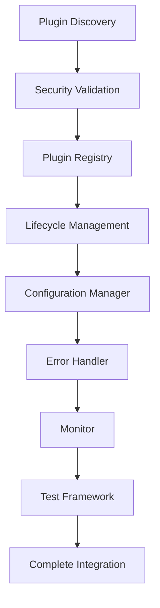
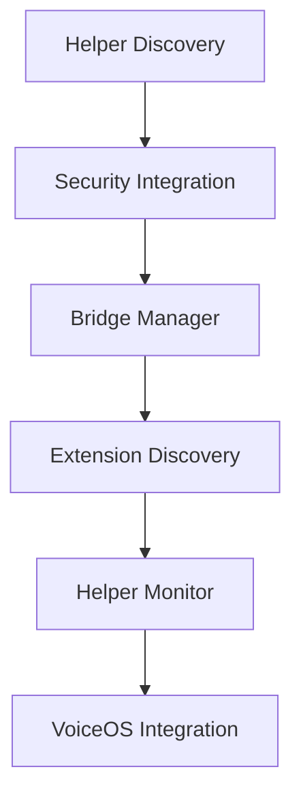
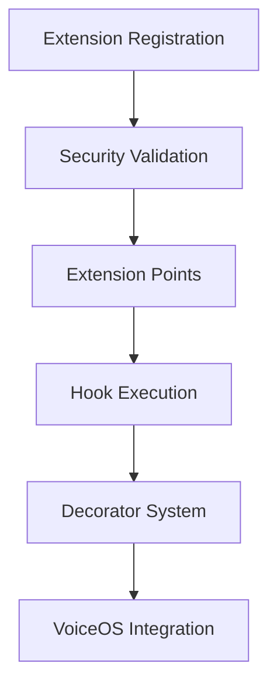

# 🔧 VoiceOS Core Integration Systems

This document provides comprehensive documentation for VoiceOS's restructured core integration systems, including plugins, helpers, extensions, and the unified integration framework.

---

## 📋 Table of Contents

- [Overview](#overview)
- [Plugin System](#plugin-system)
- [Helper System](#helper-system)
- [Extension System](#extension-system)
- [Integration Framework](#integration-framework)
- [Monitoring & Dashboard](#monitoring--dashboard)
- [Migration Guide](#migration-guide)
- [Examples](#examples)

---

## 🎯 Overview

VoiceOS features a **comprehensive integration framework** that has been restructured for better organization, maintainability, and scalability. The core system is now organized into logical subdirectories:

```
core/
├── Root Components (7 files)
├── plugins/ (8 modules) - Plugin System
├── helpers/ (4 modules) - Helper System  
├── extensions/ (2 modules) - Extension System
├── integration/ (2 modules) - Integration Framework
├── monitoring/ (2 modules) - Performance & Error Recovery
├── events/ (3 modules) - Event System
├── cli/ (2 modules) - CLI Integration
├── pipelines/ (1 module) - Stream Processing
└── system/ (2 modules) - Management & Dashboard
```

---

## 🔌 Plugin System

The plugin system provides a secure, scalable way to extend VoiceOS functionality with external plugins.

### Architecture



### Key Components

#### 1. Secure Plugin Integration (`core/plugins/secure_plugin_integration.py`)

**Purpose**: Security-first plugin loading and validation

**Features**:
- Plugin security validation
- Code analysis and sandboxing
- Permission checking
- Resource monitoring

**API**:
```python
from core.plugins.secure_plugin_integration import get_secure_plugin_adapter

adapter = get_secure_plugin_adapter()

# Validate plugin
validation_result = await adapter.validate_plugin(plugin_path)

# Load plugin with security
plugin_instance = await adapter.load_plugin_securely(plugin_path)
```

#### 2. Plugin Registry (`core/plugins/plugin_registry.py`)

**Purpose**: Centralized plugin discovery and registration

**Features**:
- Automatic plugin discovery
- Dependency resolution
- Version management
- Registry persistence

**API**:
```python
from core.plugins.plugin_registry import get_plugin_registry

registry = get_plugin_registry()

# Discover plugins
discovered = await registry.discover_plugins()

# Register plugin
result = await registry.register_plugin(plugin_path)

# Get registry state
state = registry.get_registry_state()
```

#### 3. Plugin Lifecycle (`core/plugins/plugin_lifecycle.py`)

**Purpose**: Complete plugin state management

**States**:
- `DISCOVERED` → `LOADING` → `LOADED` → `INITIALIZING` → `ACTIVE` → `SUSPENDED`

**API**:
```python
from core.plugins.plugin_lifecycle import get_lifecycle_manager

lifecycle = get_lifecycle_manager()

# Load plugin
result = await lifecycle.load_plugin("my_plugin")

# Activate plugin
result = await lifecycle.activate_plugin("my_plugin")

# Suspend plugin
result = await lifecycle.suspend_plugin("my_plugin", "Maintenance")
```

#### 4. Plugin Configuration (`core/plugins/plugin_configuration.py`)

**Purpose**: Multi-scope configuration management

**Scopes**:
- `GLOBAL` - System-wide configuration
- `PLUGIN` - Plugin-specific configuration
- `USER` - User-specific configuration
- `WORKSPACE` - Workspace-specific configuration
- `SESSION` - Session-specific configuration

**API**:
```python
from core.plugins.plugin_configuration import get_plugin_config_manager

config = get_plugin_config_manager()

# Set configuration
await config.set_config("my_plugin", "key", "value", ConfigScope.GLOBAL)

# Get configuration
value = await config.get_config("my_plugin", "key", ConfigScope.GLOBAL)
```

#### 5. Plugin Error Handling (`core/plugins/plugin_error_handling.py`)

**Purpose**: Comprehensive error recovery and reporting

**Error Categories**:
- `LOW` - Minor issues, plugin continues
- `MEDIUM` - Significant issues, may affect functionality
- `HIGH` - Critical issues, plugin may need restart
- `CRITICAL` - Fatal issues, plugin must be stopped

#### 6. Plugin Monitoring (`core/plugins/plugin_monitoring.py`)

**Purpose**: Real-time performance and health monitoring

**Metrics**:
- Execution time
- Memory usage
- CPU usage
- Error rates
- Plugin health scores

#### 7. Plugin Testing (`core/plugins/plugin_testing.py`)

**Purpose**: Built-in security and compatibility testing

**Test Types**:
- `UNIT` - Unit tests
- `INTEGRATION` - Integration tests
- `SECURITY` - Security tests
- `PERFORMANCE` - Performance tests
- `COMPATIBILITY` - Compatibility tests
- `SANDBOX` - Sandbox validation tests

#### 8. Complete Plugin Integration (`core/plugins/complete_plugin_integration.py`)

**Purpose**: Unified plugin system orchestration

**API**:
```python
from core.plugins.complete_plugin_integration import get_complete_plugin_system

system = get_complete_plugin_system()

# Enable plugin
result = await system.enable_plugin("my_plugin")

# Disable plugin
result = await system.disable_plugin("my_plugin")

# Get system status
status = await system.get_system_status()
```

---

## 🤝 Helper System

The helper system provides secure integration of helper functions with VoiceOS tools.

### Architecture



### Key Components

#### 1. Secure Helper Integration (`core/helpers/secure_helper_integration.py`)

**Purpose**: Categorized helper function management

**Categories**:
- `FILE_OPERATIONS` - File system operations
- `WEB_OPERATIONS` - Web-related operations
- `DATA_PROCESSING` - Data transformation
- `SYSTEM_OPERATIONS` - System-level operations
- `COMMUNICATION` - Network communication
- `SECURITY` - Security utilities
- `VALIDATION` - Data validation
- `UTILITIES` - General utilities

**API**:
```python
from core.helpers.secure_helper_integration import get_secure_helper_adapter

adapter = get_secure_helper_adapter()

# Register helper module
result = await adapter.register_helper_module("my_helpers", "/path/to/helpers")

# Execute helper function
result = await adapter.execute_helper("my_helpers", "my_function", args, kwargs)
```

#### 2. Helper Bridge Integration (`core/helpers/helper_bridge_integration.py`)

**Purpose**: VoiceOS tool bridging with multiple modes

**Bridge Modes**:
- `DIRECT` - Direct helper execution
- `WRAPPED` - Wrapped through VoiceOS tools
- `SANDBOXED` - Sandboxed execution
- `PROXY` - Proxy through VoiceOS interfaces

**API**:
```python
from core.helpers.helper_bridge_integration import get_helper_bridge_manager

bridge_manager = get_helper_bridge_manager(tool_registry)

# Create bridge
result = await bridge_manager.create_bridge(
    helper_name="my_helpers",
    function_name="my_function",
    voiceos_tool_name="my_tool",
    bridge_mode=BridgeMode.WRAPPED
)
```

#### 3. Helper Extension Discovery (`core/helpers/helper_extension_discovery.py`)

**Purpose**: Background discovery and validation

**Features**:
- Automatic helper discovery
- Validation and registration
- Status monitoring

#### 4. Helper Extension Monitoring (`core/helpers/helper_extension_monitoring.py`)

**Purpose**: System-wide helper metrics

**Metrics**:
- Helper execution statistics
- Performance metrics
- Health monitoring

---

## 🔗 Extension System

The extension system provides a hook-based extension framework with decorators.

### Architecture



### Key Components

#### 1. Secure Extension Integration (`core/extensions/secure_extension_integration.py`)

**Purpose**: Extension type management and security

**Extension Types**:
- `HOOK` - Function hook extensions
- `FILTER` - Data filter extensions
- `TRANSFORMER` - Data transformer extensions
- `VALIDATOR` - Data validator extensions
- `PROVIDER` - Service provider extensions
- `MIDDLEWARE` - Middleware extensions

**API**:
```python
from core.extensions.secure_extension_integration import get_secure_extension_manager

manager = get_secure_extension_manager()

# Register extension
result = await manager.register_extension("my_extension", extension_path)

# Execute extension
result = await manager.execute_extension("my_extension", ExtensionPoint.BEFORE_TOOL_EXECUTION, context)
```

#### 2. Extension Point System (`core/extensions/extension_point_system.py`)

**Purpose**: Hook-based extension with decorators

**Extension Points**:
- `BEFORE_TOOL_EXECUTION` - Before tool execution
- `AFTER_TOOL_EXECUTION` - After tool execution
- `BEFORE_LLM_REQUEST` - Before LLM request
- `AFTER_LLM_RESPONSE` - After LLM response
- `DATA_PROCESSING` - Data processing
- `USER_INPUT_VALIDATION` - User input validation
- `SYSTEM_STARTUP` - System startup
- `SYSTEM_SHUTDOWN` - System shutdown
- `ERROR_HANDLING` - Error handling
- `LOGGING_EXTENSION` - Logging

**Hook Types**:
- `BEFORE` - Execute before main operation
- `AFTER` - Execute after main operation
- `AROUND` - Execute around main operation
- `ERROR` - Execute on error
- `FINALLY` - Execute finally

**Decorators**:
```python
from core.extensions.extension_point_system import (
    before_tool_execution, after_tool_execution,
    before_llm_request, after_llm_response,
    data_processing, user_input_validation,
    error_handling, logging_decorator
)

# Use decorators
@before_tool_execution
async def my_tool_hook(context):
    print("Before tool execution")

@after_tool_execution
async def my_tool_after_hook(context):
    print("After tool execution")
```

---

## 📊 Integration Framework

The integration framework provides standardized integration approaches and controlled execution.

### Key Components

#### 1. Integration Patterns (`core/integration/integration_patterns.py`)

**Purpose**: Standardized integration approaches

**Patterns**:
- `EVENT_DRIVEN` - Loose coupling via events
- `PROXY_PATTERN` - Proxy through VoiceOS interfaces
- `ADAPTER_PATTERN` - Adapt to VoiceOS contracts
- `GATEWAY_PATTERN` - Gateway with validation
- `OBSERVER_PATTERN` - Observer for loose coupling

#### 2. Controlled Execution (`core/integration/controlled_execution.py`)

**Purpose**: Sandboxed execution with resource limits

**Execution Modes**:
- `SAFE_MODE` - Read-only operations only
- `RESTRICTED_MODE` - Limited system access
- `SANDBOXED_MODE` - Full sandbox isolation
- `ISOLATED_MODE` - Complete process isolation

**API**:
```python
from core.integration.controlled_execution import get_controlled_execution_manager

manager = get_controlled_execution_manager()

# Execute with limits
result = await manager.execute_with_limits(
    target_function,
    args,
    kwargs,
    limits=ExecutionLimits(
        max_execution_time=30.0,
        max_memory_mb=512,
        max_cpu_percent=80
    )
)
```

---

## 📈 Monitoring & Dashboard

### Key Components

#### 1. Performance Monitor (`core/monitoring/performance_monitor.py`)

**Purpose**: Real-time system performance tracking

**Metrics**:
- Execution times
- Memory usage
- CPU usage
- Error rates
- System health

#### 2. Error Recovery (`core/monitoring/error_recovery.py`)

**Purpose**: Automatic error detection and recovery

**Features**:
- Error categorization
- Automatic recovery strategies
- Error reporting and analytics

#### 3. Unified Dashboard (`core/system/unified_integration_dashboard.py`)

**Purpose**: Centralized management interface

**Views**:
- `OVERVIEW` - System overview
- `PLUGINS` - Plugin management
- `HELPERS` - Helper management
- `EXTENSIONS` - Extension management
- `MONITORING` - Performance monitoring
- `SECURITY` - Security status
- `CONFIGURATION` - System configuration

**API**:
```python
from core.system.unified_integration_dashboard import get_unified_integration_dashboard

dashboard = get_unified_integration_dashboard()

# Get system status
status = dashboard.get_system_status()

# Get system metrics
metrics = dashboard.get_system_metrics()

# Get available views
views = dashboard.get_available_views()
```

---

## 🔄 Migration Guide

### Import Path Changes

The core restructuring has changed import paths. Here's how to update your code:

#### Before (Old Structure)
```python
from core.secure_plugin_integration import get_secure_plugin_adapter
from core.event_bus import EventBus
from core.events import Events
```

#### After (New Structure)
```python
from core.plugins.secure_plugin_integration import get_secure_plugin_adapter
from core.events.event_bus import EventBus
from core.events.events import Events
```

### Complete Import Path Mapping

| Old Path | New Path |
|----------|----------|
| `core.secure_plugin_integration` | `core.plugins.secure_plugin_integration` |
| `core.plugin_lifecycle` | `core.plugins.plugin_lifecycle` |
| `core.plugin_registry` | `core.plugins.plugin_registry` |
| `core.plugin_configuration` | `core.plugins.plugin_configuration` |
| `core.plugin_error_handling` | `core.plugins.plugin_error_handling` |
| `core.plugin_monitoring` | `core.plugins.plugin_monitoring` |
| `core.plugin_testing` | `core.plugins.plugin_testing` |
| `core.complete_plugin_integration` | `core.plugins.complete_plugin_integration` |
| `core.secure_helper_integration` | `core.helpers.secure_helper_integration` |
| `core.helper_bridge_integration` | `core.helpers.helper_bridge_integration` |
| `core.helper_extension_discovery` | `core.helpers.helper_extension_discovery` |
| `core.helper_extension_monitoring` | `core.helpers.helper_extension_monitoring` |
| `core.secure_extension_integration` | `core.extensions.secure_extension_integration` |
| `core.extension_point_system` | `core.extensions.extension_point_system` |
| `core.integration_patterns` | `core.integration.integration_patterns` |
| `core.controlled_execution` | `core.integration.controlled_execution` |
| `core.performance_monitor` | `core.monitoring.performance_monitor` |
| `core.error_recovery` | `core.monitoring.error_recovery` |
| `core.event_bus` | `core.events.event_bus` |
| `core.event_handlers` | `core.events.event_handlers` |
| `core.events` | `core.events.events` |
| `core.voice_cli_integration` | `core.cli.voice_cli_integration` |
| `core.response_builder` | `core.cli.response_builder` |
| `core.stream_pipeline` | `core.pipelines.stream_pipeline` |
| `core.system_verification` | `core.system.system_verification` |
| `core.unified_integration_dashboard` | `core.system.unified_integration_dashboard` |

---

## 💡 Examples

### Example 1: Creating a Plugin

```python
# my_plugin/plugin.py
from core.plugins.secure_plugin_integration import VoiceOSPluginInterface

class MyPlugin(VoiceOSPluginInterface):
    def __init__(self):
        super().__init__(
            name="my_plugin",
            version="1.0.0",
            description="My custom plugin",
            author="Your Name"
        )
    
    async def initialize(self, context):
        """Initialize plugin"""
        self.logger.info("My plugin initialized")
    
    async def execute(self, command, context):
        """Execute plugin command"""
        if command == "hello":
            return "Hello from my plugin!"
        return None
    
    async def cleanup(self):
        """Cleanup plugin resources"""
        self.logger.info("My plugin cleaned up")
```

### Example 2: Creating an Extension

```python
# my_extension/extension.py
from core.extensions.extension_point_system import before_tool_execution

@before_tool_execution
async def my_tool_hook(context):
    """Hook that runs before tool execution"""
    print(f"About to execute tool: {context.get('tool_name')}")
    # Modify context if needed
    context['start_time'] = time.time()
    return context
```

### Example 3: Creating a Helper

```python
# my_helpers/helpers.py
import os
from pathlib import Path

def read_file_safely(file_path: str) -> str:
    """Safely read a file"""
    path = Path(file_path)
    if not path.exists():
        raise FileNotFoundError(f"File not found: {file_path}")
    
    # Security check - ensure file is in allowed directory
    if not str(path).startswith("/allowed/path"):
        raise PermissionError("Access denied")
    
    return path.read_text()

def write_file_safely(file_path: str, content: str) -> bool:
    """Safely write to a file"""
    path = Path(file_path)
    
    # Security check
    if not str(path).startswith("/allowed/path"):
        raise PermissionError("Access denied")
    
    path.write_text(content)
    return True
```

### Example 4: Integration with Dashboard

```python
# my_integration.py
from core.system.unified_integration_dashboard import get_unified_integration_dashboard

class MyIntegration:
    def __init__(self):
        self.dashboard = get_unified_integration_dashboard()
    
    async def register_custom_metrics(self):
        """Register custom metrics with dashboard"""
        await self.dashboard.register_metric_source(
            "my_integration",
            self.get_custom_metrics
        )
    
    def get_custom_metrics(self):
        """Return custom metrics"""
        return {
            "custom_counter": 42,
            "custom_status": "healthy",
            "last_update": time.time()
        }
```

---

## 🔧 System Verification

Use the built-in system verification to ensure all components are working:

```python
from core.system.system_verification import VoiceOSSystemVerification

# Run verification
verifier = VoiceOSSystemVerification()
results = await verifier.verify_all_systems()

# Check results
if results.overall_status == "PASSED":
    print("All systems ready!")
else:
    print("Some systems need attention:")
    for component, result in results.component_results.items():
        if result.status != "PASSED":
            print(f"  {component}: {result.message}")
```

---

## 📚 Additional Resources

- [API Reference](api_reference.md) - Detailed API documentation
- [Architecture Overview](architecture.md) - System architecture
- [Setup Guide](setup.md) - Installation and setup
- [Usage Guide](usage.md) - How to use VoiceOS

---

**Last Updated**: 2026-05-06
**Version**: 2.0.0 (Core Restructuring)
