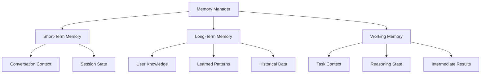

# 🧠 VoiceOS Memory Design

This document outlines the memory management system architecture and design for VoiceOS.

## Overview

VoiceOS implements a sophisticated memory system that enables agents to store, retrieve, and manage information across sessions and tasks.

## Memory Architecture

### Memory Types

#### 1. Short-Term Memory
- **Purpose**: Session-specific context and recent interactions
- **Duration**: Current session only
- **Storage**: In-memory with optional persistence
- **Usage**: Conversation context, task state, recent operations

#### 2. Long-Term Memory
- **Purpose**: Persistent knowledge and learned information
- **Duration**: Across sessions
- **Storage**: File-based database
- **Usage**: User preferences, learned patterns, historical data

#### 3. Working Memory
- **Purpose**: Active task processing and reasoning
- **Duration**: Task execution
- **Storage**: In-memory with task isolation
- **Usage**: Current task context, intermediate results

### Memory Components



## Memory Storage

### Data Structures

#### Memory Entry
```python
@dataclass
class MemoryEntry:
    """Base memory entry structure"""
    key: str
    value: Any
    category: str
    timestamp: datetime
    tags: List[str]
    importance: float  # 0.0 to 1.0
    access_count: int
    last_accessed: datetime
    expires_at: Optional[datetime]
```

#### Memory Index
```python
@dataclass
class MemoryIndex:
    """Memory indexing structure for fast retrieval"""
    category_index: Dict[str, Set[str]]
    tag_index: Dict[str, Set[str]]
    temporal_index: Dict[str, Set[str]]
    importance_index: List[Tuple[float, str]]
```

### Storage Backends

#### File-Based Storage
- **Format**: JSON with compression
- **Location**: `workspace/memory/`
- **Backup**: Automatic daily backups
- **Compression**: LZ4 for fast access

#### Database Storage (Optional)
- **Engine**: SQLite or PostgreSQL
- **Schema**: Optimized for memory queries
- **Indexing**: Full-text search support
- **Replication**: Optional for distributed setups

## Memory Operations

### Core Operations

#### Store Memory
```python
def store_memory(key: str, value: Any, category: str = "general", 
                importance: float = 0.5, tags: List[str] = None) -> str:
    """Store memory with automatic indexing"""
```

#### Retrieve Memory
```python
def retrieve_memory(key: str) -> Optional[Any]:
    """Retrieve memory by exact key match"""
```

#### Search Memory
```python
def search_memory(query: str, category: Optional[str] = None, 
                 limit: int = 10) -> List[MemoryEntry]:
    """Search memory with semantic matching"""
```

#### Update Memory
```python
def update_memory(key: str, value: Any, importance: Optional[float] = None) -> bool:
    """Update existing memory entry"""
```

#### Delete Memory
```python
def delete_memory(key: str) -> bool:
    """Delete memory entry"""
```

### Advanced Operations

#### Semantic Search
```python
def semantic_search(query: str, threshold: float = 0.7) -> List[MemoryEntry]:
    """Search using semantic similarity"""
```

#### Temporal Queries
```python
def get_memories_by_timerange(start: datetime, end: datetime) -> List[MemoryEntry]:
    """Retrieve memories within time range"""
```

#### Category Operations
```python
def get_category_memories(category: str, limit: int = 50) -> List[MemoryEntry]:
    """Get all memories in category"""
```

## Memory Management

### Automatic Cleanup

#### Expiration Policy
- **Session Memory**: 24 hours after last access
- **Working Memory**: End of task execution
- **Low Importance**: 30 days after creation
- **High Importance**: Never expires

#### Memory Limits
- **Total Memory**: 1GB default (configurable)
- **Per-Category**: 100MB default
- **Per-Task**: 10MB default

#### Cleanup Strategies
1. **LRU**: Least recently used
2. **Importance-Based**: Remove low importance first
3. **Category-Based**: Balance across categories
4. **Temporal**: Remove oldest entries

### Memory Optimization

#### Compression
- **Text**: LZ4 compression for large text
- **Binary**: Base64 encoding with compression
- **Metadata**: Optimized storage format

#### Indexing
- **Full-Text**: SQLite FTS5 integration
- **Vector**: Embedding-based similarity search
- **Tag**: Fast tag-based lookup

#### Caching
- **Hot Memory**: Frequently accessed entries
- **Session**: Current session cache
- **Query**: Result caching for repeated queries

## Integration Points

### Agent Integration

#### Memory Access Patterns
```python
class AgentMemory:
    """Agent-specific memory interface"""
    
    def store_context(self, context: Dict[str, Any]) -> None:
        """Store agent context"""
        
    def get_context(self) -> Dict[str, Any]:
        """Retrieve agent context"""
        
    def store_learning(self, key: str, learning: Any) -> None:
        """Store learned information"""
        
    def get_relevant_memories(self, query: str) -> List[MemoryEntry]:
        """Get memories relevant to current task"""
```

#### Memory-Aware Reasoning
- **Context Retrieval**: Automatic context loading
- **Memory Injection**: Include relevant memories in prompts
- **Learning Integration**: Store insights from execution

### Tool Integration

#### Tool Memory
```python
class ToolMemory:
    """Tool-specific memory management"""
    
    def store_result(self, tool_name: str, result: Any) -> None:
        """Store tool execution result"""
        
    def get_tool_history(self, tool_name: str) -> List[MemoryEntry]:
        """Get tool execution history"""
        
    def store_preference(self, tool_name: str, preference: Dict[str, Any]) -> None:
        """Store tool usage preferences"""
```

## Security and Privacy

### Access Control

#### Permission Levels
- **Public**: Non-sensitive information
- **Private**: User-specific data
- **Sensitive**: Security-critical information
- **System**: Internal system data

#### Encryption
- **At Rest**: AES-256 encryption
- **In Transit**: TLS encryption
- **Key Management**: Hardware security module support

### Privacy Features

#### Data Minimization
- **Automatic Cleanup**: Remove unnecessary data
- **Anonymization**: Strip personal identifiers
- **Retention Policies**: Configurable data retention

#### User Control
- **Memory Access**: User can view/delete memories
- **Category Management**: User can manage categories
- **Export/Import**: User data portability

## Performance Considerations

### Optimization Strategies

#### Lazy Loading
- **On-Demand**: Load memories when accessed
- **Batching**: Group memory operations
- **Prefetching**: Predictive memory loading

#### Parallel Processing
- **Concurrent Access**: Thread-safe operations
- **Async Operations**: Non-blocking memory access
- **Batch Processing**: Bulk memory operations

#### Memory Efficiency
- **Compression**: Reduce memory footprint
- **Indexing**: Fast lookup structures
- **Caching**: Intelligent caching strategies

### Monitoring

#### Metrics
- **Storage Usage**: Memory consumption
- **Access Patterns**: Usage statistics
- **Performance**: Operation latency
- **Error Rates**: Failure tracking

#### Alerts
- **Storage Limits**: Near-capacity warnings
- **Performance**: Slow operation alerts
- **Errors**: Critical error notifications

## Configuration

### Memory Settings

```yaml
# config/memory.yaml
memory:
  storage:
    backend: "file"  # file, database, hybrid
    path: "workspace/memory"
    compression: true
    encryption: true
  
  limits:
    total_size: "1GB"
    per_category: "100MB"
    per_task: "10MB"
  
  cleanup:
    auto_cleanup: true
    session_ttl: "24h"
    low_importance_ttl: "30d"
  
  indexing:
    full_text_search: true
    semantic_search: true
    vector_embeddings: false
  
  performance:
    cache_size: "100MB"
    batch_size: 100
    async_operations: true
```

### Category Configuration

```yaml
# config/memory_categories.yaml
categories:
  conversation:
    ttl: "24h"
    compression: true
    encryption: false
  
  user_preferences:
    ttl: "never"
    compression: false
    encryption: true
  
  tool_results:
    ttl: "7d"
    compression: true
    encryption: false
  
  learned_patterns:
    ttl: "never"
    compression: true
    encryption: true
```

## Future Enhancements

### Planned Features
- **Vector Database**: Advanced semantic search
- **Distributed Memory**: Multi-node memory sharing
- **Memory Graph**: Relationship-based memory organization
- **Auto-Tagging**: Automatic categorization
- **Memory Analytics**: Usage pattern analysis

### Research Areas
- **Memory Consolidation**: Intelligent memory merging
- **Forgetting Mechanisms**: Natural memory decay
- **Memory Hierarchies**: Multi-level memory organization
- **Cross-Session Learning**: Persistent learning patterns

---

**Memory design is continuously evolving. Check for updates and new features regularly!**